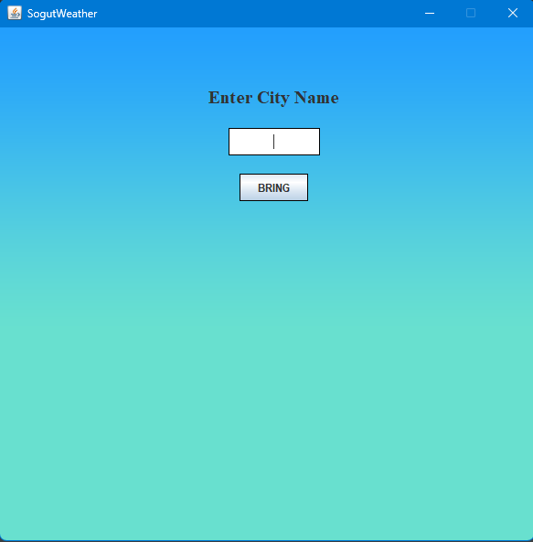
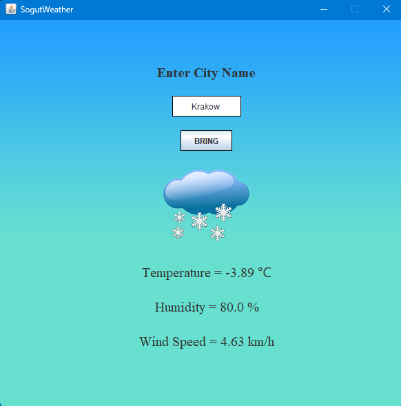
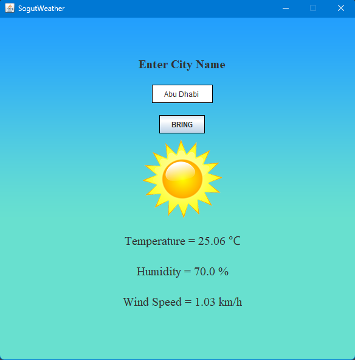

# SogutWeather

SogutWeather is a weather forecast program that provides weather information for a specified city. By entering a city's name, users can retrieve details such as temperature, humidity, wind speed, and weather condition representation (e.g., sunny, cloudy). The program utilizes the OpenWeatherMap API to fetch weather data.

## Usage

To use SogutWeather:

1. Clone the repository or download the project files.
2. Obtain an API key from [OpenWeatherMap](https://openweathermap.org/api) (if you don't have one).
3. Open the project in your preferred Java development environment.
4. In the source code, locate the place where the API key is needed and insert your own API key.
5. Compile and run the program.
6. Enter the city name for which you want to fetch the weather information.
7. View the temperature, humidity, wind speed, and weather condition representation.

## Screenshots

Here are some screenshots of the SogutWeather application:

<!-- Add more screenshots if needed -->

## OpenWeatherMap API

SogutWeather uses the OpenWeatherMap API to retrieve weather data for the specified city. Make sure to replace `YOUR_API_KEY` in the source code with your actual API key obtained from OpenWeatherMap.

## Requirements

- Java
- Internet connection

## Notes

- The project is developed using Java.
- The API key for OpenWeatherMap is required to fetch weather data. Make sure to keep it secure and do not share it publicly.

## Contributions

Contributions to the project are welcome! Feel free to fork the repository and submit a pull request with any improvements or new features.
